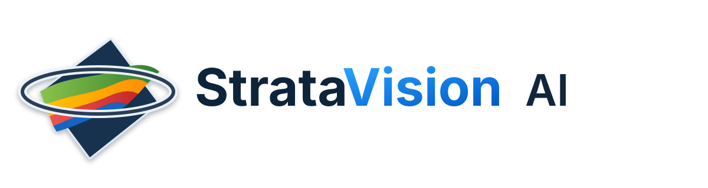
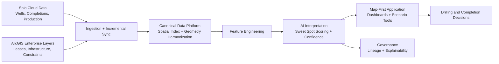

# StrataVision™ AI Subsurface Intelligence Platform

  <picture>
    <source media="(max-width: 768px)" srcset="docs/assets/stratavision-logo-compact.svg">
    
  </picture>

<em>Solo Cloud-Integrated Well Data + ArcGIS Spatial Framework</em>

StrataVision AI is a map-first subsurface intelligence platform that integrates geology grids, well, completion, and production data from Solo Cloud with enterprise ArcGIS spatial layers. The system provides AI-driven interpretation, spatial analytics, and sweet spot identification to help geology and reservoir teams optimize drilling and completion decisions.

## Platform Vision

StrataVision AI unifies technical subsurface data and geospatial intelligence into a single operational view. Geoscience and reservoir teams can move from raw data to actionable insight faster by combining:

- Solo Cloud data services for wells, completions, and production history
- ArcGIS enterprise layers for leases, infrastructure, and environmental constraints
- AI-assisted interpretation to identify prospective drilling and completion targets

## Core Capabilities

### 1) Solo Cloud Data Integration

- Ingest structured and time-series subsurface datasets
- Normalize well headers, trajectories, completions, and production streams
- Maintain history-aware records for trend and decline analysis

### 2) ArcGIS Spatial Intelligence

- Overlay enterprise GIS layers with subsurface assets
- Perform map-first filtering for geologic and operational constraints
- Support zone-level and pad-level planning with interactive spatial context

### 3) AI-Driven Interpretation

- Detect productivity patterns and analogs from historical outcomes
- Generate sweet spot scoring surfaces and ranked candidate zones
- Provide explainable factors behind recommendations

### 4) Decision Optimization

- Prioritize drilling targets by geologic quality, accessibility, and economics
- Compare completion strategy scenarios using observed analog performance
- Deliver repeatable, auditable recommendations for cross-team collaboration

## Reference Architecture

1. **Ingestion Layer**
   - Solo Cloud API connectors
   - ArcGIS feature service connectors
   - Batch and incremental sync jobs

2. **Data Platform Layer**
   - Canonical subsurface data model
   - Spatial indexing and geometry harmonization
   - Feature engineering pipelines for AI models

3. **Intelligence Layer**
   - Pattern discovery and forecasting models
   - Sweet spot ranking and uncertainty scoring
   - Rule-based constraints from geoscience workflows

4. **Application Layer**
   - Map-first web experience
   - Analytics dashboards and scenario tools
   - Report exports for technical and leadership teams

### Concise Architecture Diagram

## Typical Workflow

1. Synchronize wells, completions, and production from Solo Cloud.
2. Join records with ArcGIS lease and infrastructure layers.
3. Build spatial + temporal features for AI interpretation.
4. Generate sweet spot rankings and confidence metrics.
5. Review recommendations in map context and finalize targets.

## Data Domains

- Geology grids and stratigraphic surfaces
- Well trajectories and directional surveys
- Completion intervals and treatment designs
- Daily and monthly production performance
- ArcGIS layers (leases, infrastructure, environmental and regulatory zones)

## Security and Governance Principles

- Role-based access controls aligned to enterprise identity providers
- Dataset lineage and provenance for auditability
- Environment isolation between development, staging, and production
- Traceable model versions with metadata on training inputs

## Product Outcomes

StrataVision AI helps subsurface teams:

- Reduce interpretation cycle times
- Improve target quality and placement confidence
- Increase drilling and completion consistency
- Align geoscience, engineering, and operations around shared spatial evidence

## Roadmap

- Real-time event ingestion for near-live production signals
- Expanded uncertainty quantification and probabilistic mapping
- Automated analog recommendation and type-curve clustering
- Multi-basin model transfer learning and calibration workflows
